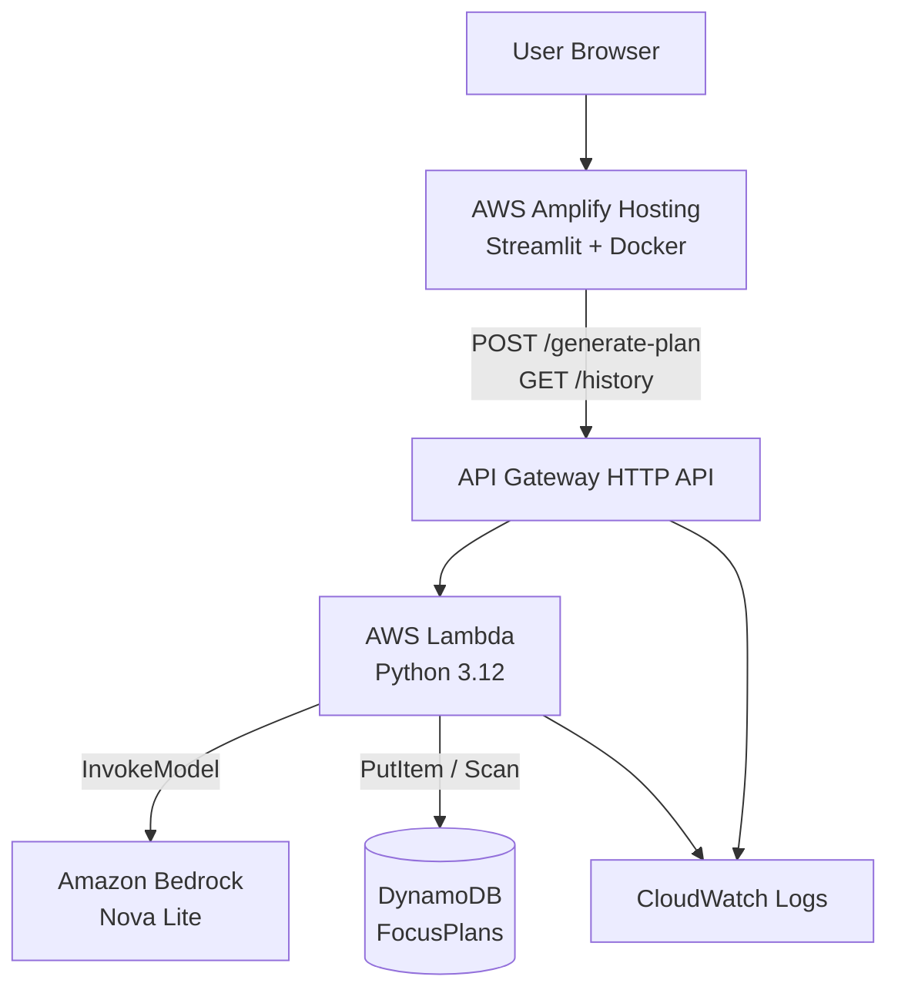

# FocusFlow AI — Architecture

An AI-powered productivity planner that turns a daily brain dump into a prioritized action plan using Amazon Bedrock (Nova Lite).

## Design Goals

- Finishable in a weekend challenge
- AWS Well-Architected basics: least privilege, observability, cost control
- Simple, readable modules — no overengineering

## High-Level Architecture



## Component Responsibilities

| Component | Responsibility |
|---|---|
| **Streamlit (Amplify)** | UI for task input, plan display, and history. Calls API Gateway via HTTPS. |
| **API Gateway HTTP API** | Public HTTPS entry, CORS, optional API key, routes to Lambda. |
| **Lambda** | Validate input, call Bedrock, parse JSON, persist to DynamoDB, return responses. |
| **Bedrock Nova Lite** | Generate structured productivity plan as JSON. |
| **DynamoDB FocusPlans** | Store each plan (tasks + AI output + timestamp). |
| **CloudWatch Logs** | Structured logs for API and Lambda troubleshooting. |

## Request Flows

### Generate Plan — `POST /generate-plan`

1. User submits a brain dump in Streamlit.
2. Frontend sends `{ "tasks": "..." }` to API Gateway.
3. Lambda validates (non-empty, max length).
4. Lambda builds a productivity-coach prompt and invokes Bedrock Nova Lite.
5. Lambda parses and validates the JSON response.
6. Lambda writes an item to DynamoDB (`planId`, tasks, priority, schedule, tips, `createdAt`).
7. Lambda returns the plan JSON to the client.
8. Streamlit renders Priority, Schedule, Focus Tip, and Motivation.

### History — `GET /history`

1. User opens the History page.
2. Frontend calls `GET /history`.
3. Lambda scans DynamoDB (limit 20), sorts by `createdAt` descending.
4. Streamlit displays previous plans.

## Data Model — DynamoDB `FocusPlans`

| Attribute | Type | Notes |
|---|---|---|
| `planId` | String (PK) | UUID v4 |
| `tasks` | String | Original user brain dump |
| `priority` | List (String) | Ordered tasks |
| `schedule` | List (String) | Suggested time blocks |
| `focusTip` | String | One productivity tip |
| `motivation` | String | One motivational message |
| `createdAt` | String | ISO-8601 UTC |

**Billing mode:** On-demand  
**Access pattern (v1):** PutItem on create; Scan + in-memory sort for history (challenge scale).

## API Contract

### `POST /generate-plan`

**Request**
```json
{
  "tasks": "- Finish AWS article\n- Study Terraform\n- Grocery shopping"
}
```

**Success response (`200`)**
```json
{
  "planId": "550e8400-e29b-41d4-a716-446655440000",
  "priority": ["Finish AWS article", "Study Terraform", "Grocery shopping"],
  "schedule": ["09:00–10:30 Focus: Finish AWS article", "10:45–12:00 Study Terraform"],
  "focus_tip": "Batch shallow tasks after deep work.",
  "motivation": "One focused block beats a scattered day."
}
```

### `GET /history`

**Success response (`200`)**
```json
{
  "plans": [
    {
      "planId": "...",
      "tasks": "...",
      "priority": [],
      "schedule": [],
      "focus_tip": "...",
      "motivation": "...",
      "createdAt": "2026-07-11T12:00:00Z"
    }
  ]
}
```

## Security

- IAM least privilege on the Lambda execution role (Bedrock invoke on model ARN, DynamoDB on table ARN, logs on log group).
- No secrets in source; configuration via Terraform variables and Lambda environment variables.
- CORS restricted to Amplify origin when known; challenge demos may temporarily allow `*`.
- Optional API key on HTTP API for light abuse protection (no Cognito in v1).
- DynamoDB is private to the account; not publicly exposed.

## Observability

Lambda logs (structured):

- Incoming request (path, truncated payload size)
- Bedrock invocation start/success/failure
- DynamoDB write success/failure
- Validation and unexpected errors

CloudWatch Log Group retention: 14 days.

## Cost Controls (Challenge-Friendly)

- DynamoDB on-demand (no idle capacity cost)
- Lambda short timeout / modest memory
- Nova Lite (low cost per invoke)
- Log retention capped at 14 days
- Input length limit to bound Bedrock tokens

## Explicit Non-Goals (v1)

- Cognito / user accounts
- Custom domain / Route 53
- WAF, VPC, DLQ, X-Ray
- Multi-environment CI/CD
- DynamoDB GSI for history

## Deployment status

See [deployment.md](deployment.md) for the live `us-east-1` endpoints and smoke-test results.
See [amplify-deploy.md](amplify-deploy.md) for frontend hosting.

## Failure Modes

| Failure | Handling |
|---|---|
| Empty / oversized tasks | `400` with clear message |
| Malformed JSON body | `400` |
| Bedrock timeout / error | `502` / `503`, logged |
| Invalid model JSON | Retry parse once or return `502` |
| DynamoDB write failure | Log error; prefer returning plan if generation succeeded (degraded) or `500` — decide in implementation |
| Unknown route | `404` |

## Provisioning

Everything except Bedrock *model access enablement* (account/region console prerequisite) is provisioned with Terraform under `terraform/`.
